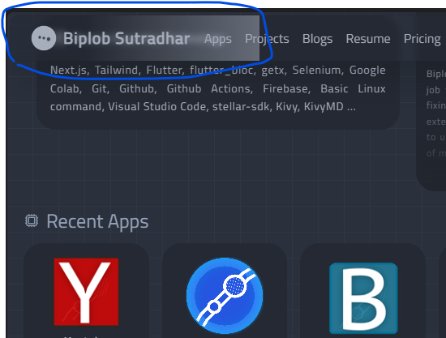
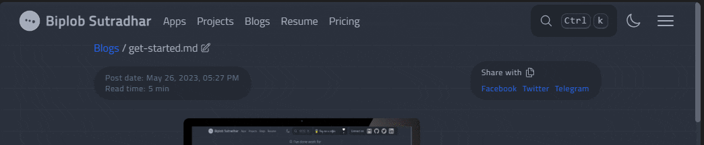
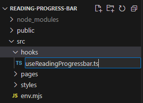
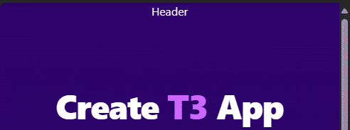

# Creating a Gradient Reading Progress Bar in NextJS with TailwindCSS

I am building this portfolio website to showcase my app and services to the world. During my research on portfolio blog sites, I came across a reading progress bar that is placed at the top of the page to indicate how much of the post is left to read.

This progress bar is a good way to know how much content is remaining and it provides feedback to the user, potentially improving the user experience of the website.



I found a tutorial by Anshuman Bhardwaj that explains how to implement a reading progress bar in a React and TailwindCSS project. Since my site is built with NextJS and TailwindCSS, I was able to adapt the tutorial to suit my website.

https://theanshuman.dev/articles/creating-a-read-progress-bar-in-react-and-tailwindcss-g1n

Let's see how to create a reading progress bar like the one on my website.

## Getting Started

If you want to access the full source code for this project, you can find it on the tutorial's below source code section.

## Create a Hook File in Your NextJS Project



Copy this code snippet below and save it as `useReadingProgressbar.ts` file.

## Code snippet

```typescript
import { useEffect, useState } from "react";
import { useRouter } from "next/router";

/**
 * React Hook to get the scroll percentage from the page, returns value from 0 to 100
 */
export function useReadingProgress() {
  const [completion, setCompletion] = useState(0);
  const router = useRouter();

  useEffect(() => {
    function updateScrollCompletion() {
      // see how much we have scrolled
      const currentProgress = window.scrollY;
      // see how much total scroll is available
      const scrollHeight = document.body.scrollHeight - window.innerHeight;
      if (scrollHeight) {
        setCompletion(
          Number((currentProgress / scrollHeight).toFixed(2)) * 100
        );
      }
    }

    function handleRouteChange() {
      setCompletion(0); // Reset completion when the route changes
    }

    // Add scroll and route change event listeners
    window.addEventListener("scroll", updateScrollCompletion);
    router.events.on("routeChangeStart", handleRouteChange);

    // Remove event listeners on unmount
    return () => {
      window.removeEventListener("scroll", updateScrollCompletion);
      router.events.off("routeChangeStart", handleRouteChange);
    };
  }, [router]);

  return completion;
}
```

This code snippet was obtained from Anshuman Bhardwaj's blog post. I have added an additional NextJS router event to reset the completion to 0 when the page changes. This ensures that the reading progress bar will be updated when a user visits another blog post.

## Styling

```typescript
import { useReadingProgress } from "~/hooks/useReadingProgressbar";

export default function Header() {
  const completion = useReadingProgress();

  return (
    <header
      style={{
        backgroundSize: `${completion}%`,
        backgroundRepeat: "no-repeat",
      }}
      className="sticky top-0 h-14 w-full bg-gradient-to-r from-red-500/30 from-30% to-blue-500/50 to-100% backdrop-blur-sm transition-all duration-500 ease-in-out "
    >
      <div className="text-center text-white">Header</div>
    </header>
  );
}
```

I have used a TailwindCSS gradient and adjusted the `backgroundSize` CSS property to reflect the completion percentage. This also supports the transition utility for smooth animations.

## Preview



## Source Code

You can find the source code for this tutorial on https://github.com/biplobsd/reading-progress-bar

You can also see the implementation of this reading progress bar on the PNP website, which is an open-source project.

https://github.com/SpeedOut-Source/pnp/blob/82093fda9ce75e7d63c82bd378d8b77a7a08ef79/src/components/header/header.tsx#L49C7-L61C8

## Conclusion

That's it! If you have any questions, feel free to ask in the comment box below.
🚀🚀🚀🚀
