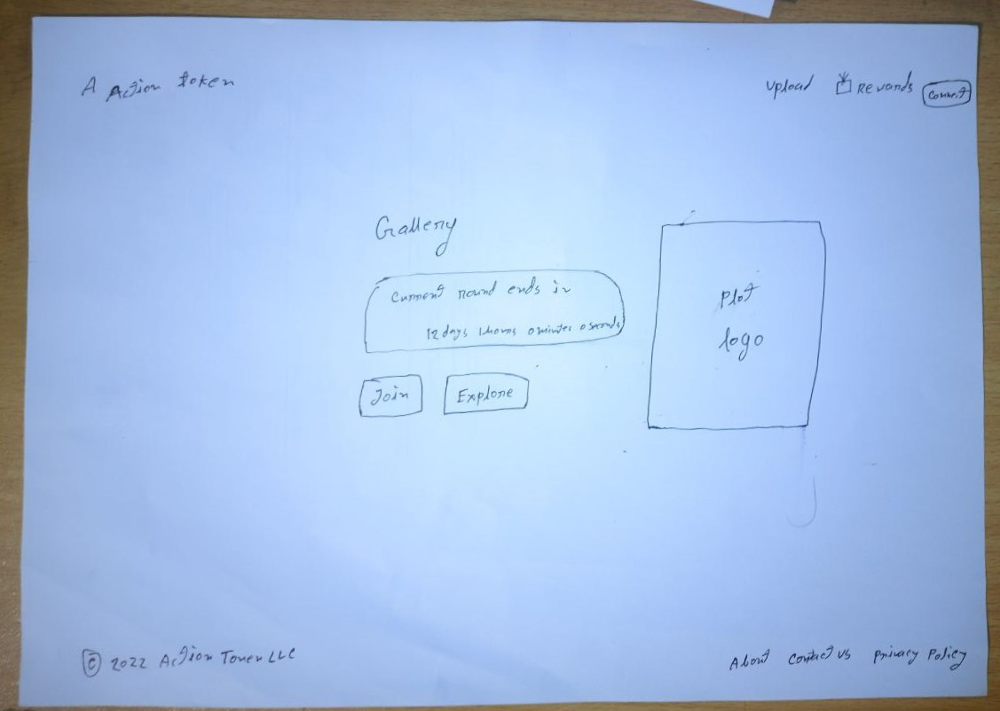
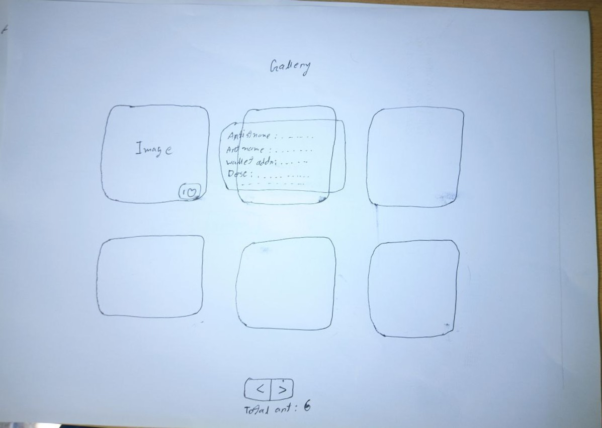
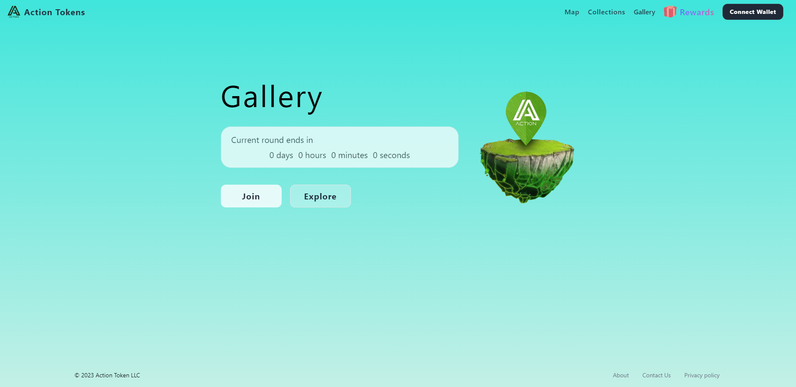
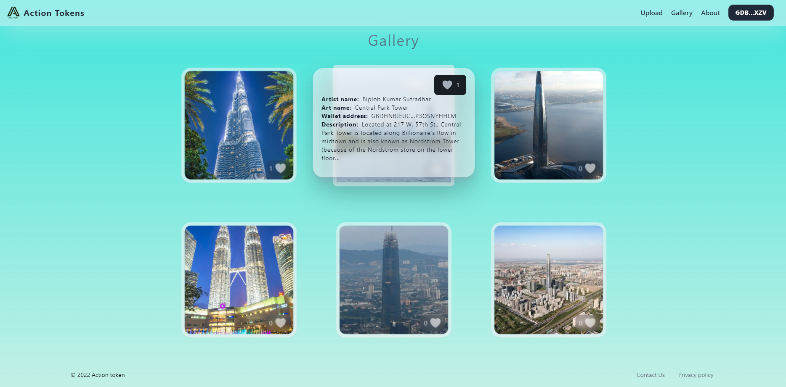
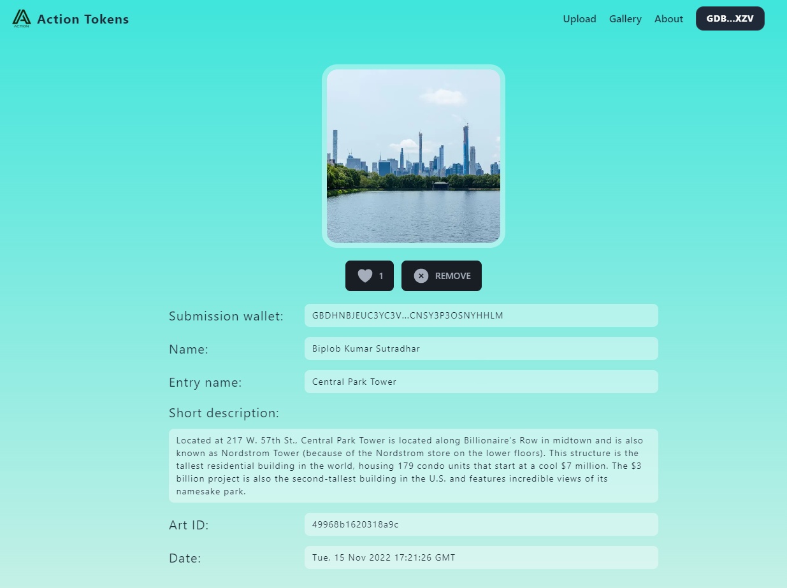
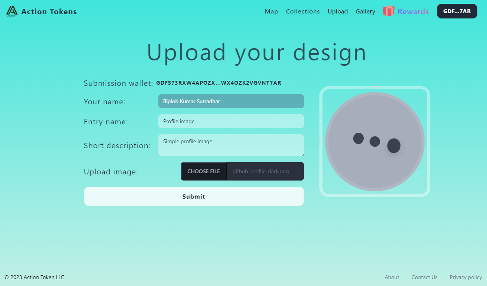
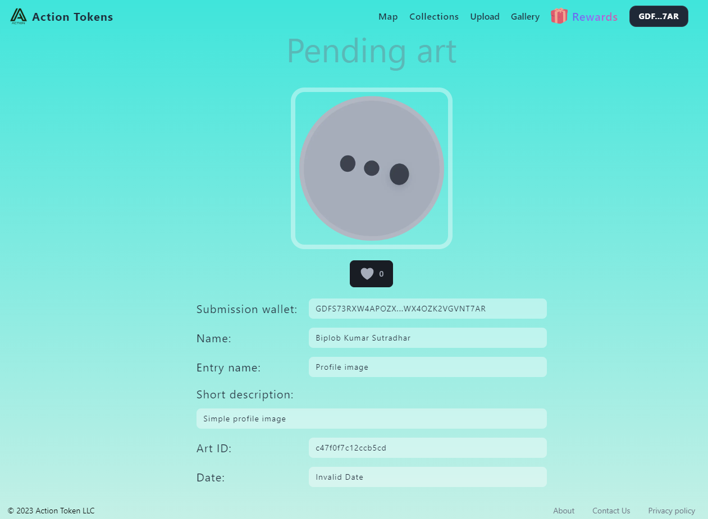
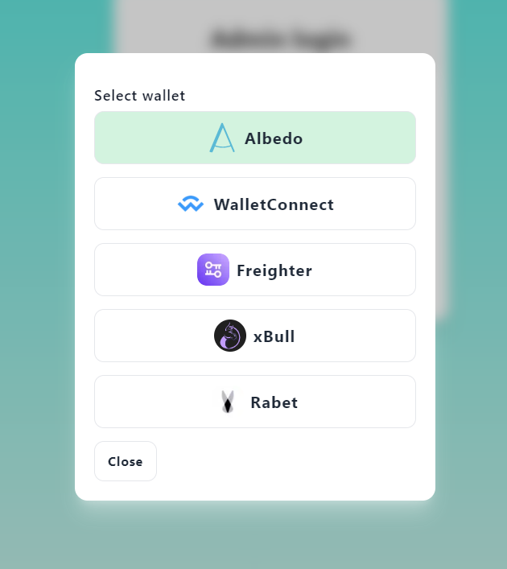

# Action Tokens Gallery - Image Sharing Website

<a href="https://gallery.action-tokens.com/">Live at gallery.action-tokens.com</a>

## Overview

Action Tokens Gallery is a website built with Next.js and Firebase as its database service, that allows users to share their images and showcase their art. The main focus of the website is to provide a simple, fast, and user-friendly UI to users. The objective was to create a cost-efficient full-stack solution with minimal clicks to find information on the website.

## Problem

The main challenge was to create a user-friendly UI that would enable users to upload their images quickly. The UI had to be simple and straightforward, making it easy for users to navigate the website. The cost was another important factor to consider while designing the website.

## Solution

After conducting thorough research, our team chose

- Next.JS as framework
- TailwindCSS for frontend
- Firebase Firestore for backend database
- Amazon Amplifier was used as the Next.JS hosting

## Design

The website's design was based on the client's requirements and ideas. We began by creating initial drawings on paper and went through several iterations before finalizing the website's design. We focused on creating a minimalist, user-friendly UI that would require fewer clicks to find information. We used TailwindCSS to achieve this design.

### Initial drawing

### Final design

## Features

- Allows users to share images
- Built with Next.js framework and Firebase database service
- Supports wallet clients including Albedo, Wallet Connect, Freighter, XBull, and Rabet
- Upload art it will be on the admin approval.
- Admin can delete any art from the admin panel.

## Technology

Action Tokens Gallery was built using the following technologies:

- Next.js with TypeScript, a React-based web framework for server-side rendering.
- Firebase Firestore as the NoSQL database, providing data from cloud.
- TailwindCSS, a utility-first CSS framework for fast and easy customization
- Amazon Amplify as the backend hosting
- Wallet client - Albedo, Wallet Connect, Freighter, XBull, and Rabet providing wallet client integration

## Team

- Jose Urquiza, <a href='https://twitter.com/@hollowvox'>@hollowvox</a>: Funned, Manager
- Biplob Kumar Sutradhar, <a href='https://twitter.com/@biplobsd11'>@biplobsd11</a>: Lead Developer
- Arnob dey, <a href='https://twitter.com/@arnob_016'>@arnob_016</a>: Design, client requirement sync

## Conclusion

Action Tokens Gallery is simple image gallery, Stellar user can share image within a some second and share this image to their friend and family. The website also integrates with various wallet clients for sharing and showcasing artwork seamless. The website is built on Next.js framework and uses Firebase as its database service, providing a cost-efficient full-stack solution. The UI design is minimalist, with a focus on optimizing user experience and requiring minimal clicking to navigate the website.
